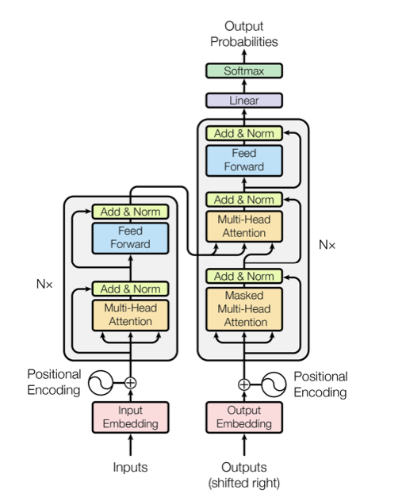
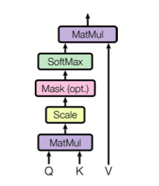
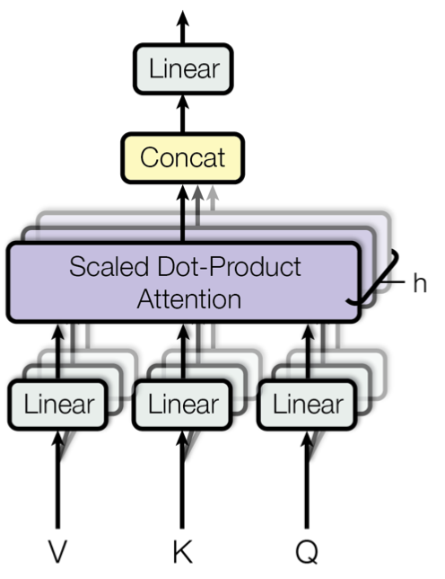
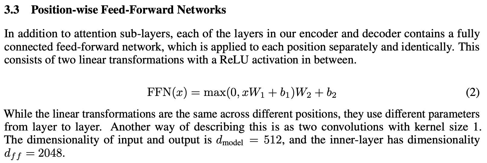
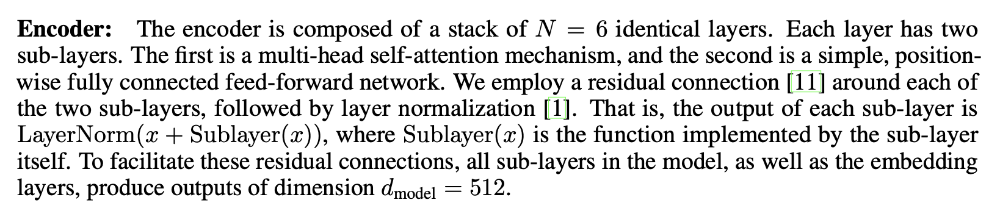
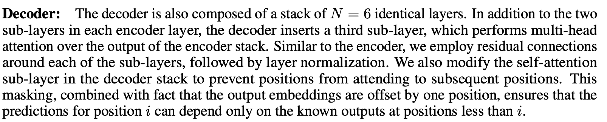

# attention-is-all-you-need

```python
import torch
import torch.nn as nn
import torch.nn.functional as F
import numpy as np
```




```python
class PositionalEncoding(nn.Module):
    
    def __init__(self, d_model):
        super(PositionalEncoding, self).__init__()
        self.d_model = d_model
    
    def _get_positional_encoding(self, n_positions):
        
        # Get numpy arrays with positions and dimensionss
        dimensions, positions = np.ix_(np.arange(self.d_model),np.arange(n_positions))
        
        # Compute frequency
        positional_encoding = positions / (np.power(10000,2*dimensions/self.d_model))
        
        # Map frequency to sinusoidal value
        positional_encoding[:, 0::2] = np.sin(positional_encoding[:, 0::2])  # dim 2i
        positional_encoding[:, 1::2] = np.cos(positional_encoding[:, 1::2])  # dim 2i+1
        
        return torch.tensor(positional_encoding).T.unsqueeze_(0)
        
    def forward(self, x):
        return x + self._get_positional_encoding(x.shape[1])
    
```

## Scaled Dot-Product Attention


**Input**

- Queries: $q \in \mathbb{R}^{d_k}$
- Keys: $k \in \mathbb{R}^{d_k}$
- Values: $v \in \mathbb{R}^{d_v}$

> In practice, we compute the attention function on a set of queries simultaneously, packed together into a matrix Q. The keys and values are also packed together into matrices K and V .

**Definition** 

We define the _attention_ between a set of queries, keys and values as follows:

$$
\mathrm{Attention}(q,k,v) = \mathrm{softmax} \left( \frac{QK^\top}{\sqrt{d_k}} \right) V
$$




```python
def scaled_dot_product_attention(Q, K, V, temperature, dropout, mask = None):
    attn = Q.bmm(K.transpose(1, 2))   
    
    if mask is not None:
        attn = attn.masked_fill(mask == 0, -1e9)
            
    attn = F.softmax(attn / temperature, dim=-1)
    attn = dropout(attn)
    return attn.bmm(V)
```

## MultiHead Attention

**Input**

- Queries (Q)

- Keys (K)      
- Values (H)

The idea is to linearly project the queries, keys and values h times with different, learned linear projections. The projections are given by parameter matrices:

1.  $W_i^Q \in \mathbb{R}^{d_{model} \times d_k}$
2. $W_i^K \in \mathbb{R}^{d_{model} \times d_k}$
3. $W_i^V \in \mathbb{R}^{d_{model} \times d_v}$:

Then each head is given by:
$$
\mathrm{head_i} = \mathrm{Attention}(Q W_i^Q, KW_i^K, VW_i^V)
$$




```python
class AttentionHead(nn.Module):
    
    def __init__(self, d_model, d_k, d_v, dropout = .1):
        
        super(AttentionHead, self).__init__()
        
        self.W_Q = nn.Linear(d_model, d_k, bias = False)
        self.W_K = nn.Linear(d_model, d_k, bias = False) 
        self.W_V = nn.Linear(d_model, d_v, bias = False) 
        
        self.dropout = nn.Dropout(dropout)
        self.temperature = d_k**2
    
    def forward(self, Q,K,V, mask=None):
        
        Q = self.W_Q(Q)
        K = self.W_K(K)
        V = self.W_V(V)
        
        head = scaled_dot_product_attention(Q, K, V, self.temperature, self.dropout, mask=mask)
        return head
    
#AttentionHead(512,1,1)
```

On each of these projected queries, keys and values we perform the attention function yielding $h$ $d_v$-dimensional outputs. These values are concatenated and projeted again:

$$
\mathrm{MultiHeadAttention}(Q,K,V) = \mathrm{Concat}(\mathrm{head_1}, ..., \mathrm{head_h})W^O
$$


```python
class MultiHeadAttention(nn.Module):
    
    def __init__(self, h, d_model, d_k, d_v, dropout = .1):
        
        super(MultiHeadAttention, self).__init__()

        self.W_O = nn.Linear(h * d_v, d_model, bias=False)
        self.heads = nn.ModuleList(
            [AttentionHead(d_model, d_k, d_v, dropout) for _ in range(h)]
        )    

    def forward(self, Q, K, V,mask=None):
        
        heads = [h(Q,K,V,mask) for h in self.heads]    
        return self.W_O(torch.cat(heads, dim=-1))
    
#MultiHeadAttention(6,512,1,1)
```




```python
class PositionwiseFeedForward(nn.Module):

    def __init__(self, d_model = 512, d_hidden = 2048, dropout=0.1):
        super(PositionwiseFeedForward, self).__init__()
        self.W1 = nn.Linear(d_model, d_hidden) 
        self.W2 = nn.Linear(d_hidden, d_model)

    def forward(self, x):
        return self.W2(F.relu(self.W1(x)))
    
```

## Encoder



#### Residual connection


```python
class Residual(nn.Module):
    def __init__(self, sublayer, d_model):
        super(Residual, self).__init__()
        self.layer_normalization = nn.LayerNorm(d_model)
        self.current_sublayer = sublayer

    def forward(self, *x, mask=None):
        if mask is None:
            return self.layer_normalization(x[-1] + self.current_sublayer(*x))
        else:
            return self.layer_normalization(x[-1] + self.current_sublayer(*x,mask=mask))
        
    
```

#### Encoder layer


```python
class EncoderLayer(nn.Module):
    def __init__(self, h, d_model, 
                 attn_dropout = .1, 
                 feed_forward_dropout = .1
                ):
        
        super(EncoderLayer, self).__init__()
        
        d_k = d_model // h
        d_v = d_model // h
        
        self.attention = Residual(
            MultiHeadAttention(
                h, d_model, d_k, d_v, dropout = attn_dropout
            ),
            d_model
        )
        
        self.feed_forward = Residual(
            PositionwiseFeedForward(
                d_model = d_model, dropout = feed_forward_dropout
            ),
            d_model
        )
        
    def forward(self, x, mask = None):
        return self.feed_forward(self.attention(x,x,x,mask=mask))
    
#EncoderLayer(6,512)
```

#### Encoder


```python
class Encoder(nn.Module):
    def __init__(self, num_tokens, N = 6, h = 8, 
                 d_model = 512, 
                 d_word_vec = 512,
                 attn_dropout = .1, 
                 feed_forward_dropout = .1,
                 n_positions = 512):
        
        super(Encoder, self).__init__()
        
        self.d_model = d_model
        self.token_emb = nn.Embedding(num_tokens, d_word_vec)
        self.positional_enc = PositionalEncoding(n_positions)
        
        self.layers = nn.ModuleList(
            [
                EncoderLayer(h, d_model, attn_dropout, feed_forward_dropout )
                for _ in range(N)
            ]
        )
        
        
    def forward(self, x):
        x = self.token_emb(x)
        x = self.positional_enc(x).float()
        
        for layer in self.layers:
            x = layer(x)
            
        return x
```


## Decoder



#### Decoder layer


```python
class DecoderLayer(nn.Module):
    def __init__(self, h, d_model, 
                 attn_dropout = .1, 
                 feed_forward_dropout = .1):
        
        super(DecoderLayer, self).__init__()
        
        d_k = d_model // h
        d_v = d_model // h
        
        self.self_attention = Residual(
            MultiHeadAttention( 
                h, d_model, d_k, d_v, dropout = attn_dropout
            ),
            d_model
        )
        
        self.encoder_decoder_attention = Residual(
            MultiHeadAttention( 
                h, d_model, d_k, d_v, dropout = attn_dropout
            ),
            d_model
        )
        
        self.feed_forward = Residual(
            PositionwiseFeedForward(
                d_model = d_model, dropout = feed_forward_dropout
            ),
            d_model
        )

        
    def forward(self, decoder_input, encoder_output, self_attn_mask = None):
        
        decoder_output = self.self_attention(decoder_input, decoder_input, 
                                             decoder_input, mask = self_attn_mask)
        
        attn = self.encoder_decoder_attention(decoder_output, encoder_output, encoder_output)
        
        return self.feed_forward(attn)

```


```python
class Decoder(nn.Module):
    def __init__(self, num_tokens, N = 6, h = 8, 
                 d_model = 512, 
                 d_word_vec=512,
                 attn_dropout = .1, 
                 feed_forward_dropout = .1,
                 n_positions = 200):
        
        super(Decoder, self).__init__()
        
        self.d_model = d_model
        self.token_emb = nn.Embedding(num_tokens, d_word_vec)
        self.positional_enc = PositionalEncoding(n_positions)
        
        self.layers = nn.ModuleList(
            [DecoderLayer(h, d_model, attn_dropout, 
                          feed_forward_dropout)
             for _ in range(N)
            ]
        )
        
    
    def forward(self, target, encoder_output, self_attn_mask):
        
        target = self.token_emb(target)
        dec_output = self.positional_enc(target).float()
        
        for layer in self.layers:
            dec_output = layer(dec_output, encoder_output, self_attn_mask = self_attn_mask)
            
        return dec_output
    
```

#### Decoder masking

>We also modify the self-attention sub-layer in the decoder stack to prevent positions from attending to subsequent positions. This masking, combined with fact that the output embeddings are offset by one position, ensures that the predictions for position i can depend only on the known outputs at positions less than i


```python
def get_subsequent_mask(seq):
    sz_b, len_s = seq.size()
    subsequent_mask = (1 - torch.triu(
        torch.ones((1, len_s, len_s), device=seq.device), diagonal=1)).bool()
    return subsequent_mask
```

# Transformer


```python
class Transformer(nn.Module):
    
    def __init__(self, num_tokens_src, num_tokens_tgt, 
                 d_word_vec = 512,
                 N = 6, h = 8, 
                 d_model = 512, 
                 attn_dropout = .1, 
                 feed_forward_dropout = .1,
                 n_positions = 512):
        
        super(Transformer, self).__init__()
        
        
        self.encoder = Encoder(
                 num_tokens_src, N, h, 
                 d_model, 
                 d_word_vec,
                 attn_dropout, 
                 feed_forward_dropout,
                 n_positions
        )
        
        self.decoder = Decoder(
                 num_tokens_tgt, N, h, 
                 d_model, 
                 d_word_vec,
                 attn_dropout, 
                 feed_forward_dropout,
                 n_positions
        )
        
        self.linear = nn.Linear(d_model, num_tokens_tgt) 
        
    def forward(self, source, target):
        
        mask = get_subsequent_mask(target)
        
        encoder_output = self.encoder(source)

        dec_output = self.decoder(target, encoder_output, mask)
        
        dec_output = self.linear(dec_output)
        
        return dec_output
        

```


```python
src = torch.randint(0, 256, (1, 1024))
tgt = torch.randint(0, 412, (1, 1024))
T = Transformer(256,412,N=8,h=6)
ans = T(src, tgt)
```


